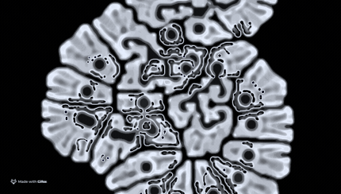

# Multi-Layer Reaction/Diffusion

This processing sketch renders 3 layers of reaction diffusion at different scales that influence each other. This leads to different detail-levels in the result. Have a look at the `keyPressed` function to see what the options are:

```
void keyPressed() {
  if(key == 'p') record = !record;
  if(key == 'x') {
    showUI = !showUI;
    cp5.setVisible(showUI);
  }
  if(key == 'y') {
    l1.clear(); l2. clear(); l3.clear();
  }
  if(key == 'c') colorizeit = !colorizeit;
  if(key == 'r') seedWithTex("data/texture.png");
  if(key == ' ') paused = !paused;
  if(key == 'n') blurEnabled = !blurEnabled;
  if(key == '1') mode = 1;
  if(key == '2') mode = 2;
  if(key == '3') mode = 3;
  if(key == 'z') zoom = !zoom;
  if(key == '#') saveState();
  if(key == '+') loadState();
}
```

